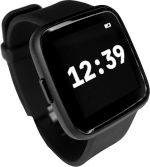
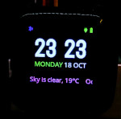

<pre>
 ######                  #######                           #######  #####  
 #     # # #    # ######    #    # #    # ######     ####  #     # #     # 
 #     # # ##   # #         #    # ##  ## #         #    # #     # #       
 ######  # # #  # #####     #    # # ## # #####     #      #     #  #####  
 #       # #  # # #         #    # #    # #         #      #     #       # 
 #       # #   ## #         #    # #    # #         #    # #     # #     # 
 #       # #    # ######    #    # #    # ######     ####  #######  #####  

 PineTime-cOS
</pre>

# PineTime smartwatch

The **Pinetime** smartwatch is built around the NRF52832 MCU (512KB Flash, 64KB RAM), a 240*240 LCD display driven by the ST7789 controller, an accelerometer, a heart rate sensor, and a vibration motor.

> The PineTime is a free and open source smartwatch capable of running custom-built open operating systems. Some of the notable features include a heart rate monitor, a week-long battery, and a capacitive touch IPS display that is legible in direct sunlight. It is a fully community driven side-project which anyone can contribute to, allowing you to keep control of your device.

*https://www.pine64.org/pinetime/*

*https://wiki.pine64.org/index.php/PineTime*

PineTime-cOS 
========================================

The purpose of **PineTime-cOS** is to build a firmware for Pinetime that is lightweight:

 - Code written in **C**;
 - Build system based on **Make**;
 - Based on **[FreeRTOS 10.0.0](https://freertos.org)** real-time OS;
 - UI library **[LVGL 8](https://lvgl.io/)**;
 - Bluetooth **[S112 nrf52 7.2.0 softdevice](https://www.nordicsemi.com/Products/Development-software/nRF5-SDK)**;

Build and flash PineTime-cOS 
========================================
<pre>
$ git clone --recurse-submodules https://github.com/joaquimorg/PineTime-cOS.git
$ cd PineTime-cOS
$ make -j
</pre>

Docs
========================================

Web Bluetooth Secure DFU : https://thegecko.github.io/web-bluetooth-dfu/examples/web.html

Nordic's Secure DFU bootloader, a step by step guide

https://devzone.nordicsemi.com/nordic/short-range-guides/b/software-development-kit/posts/getting-started-with-nordics-secure-dfu-bootloader
